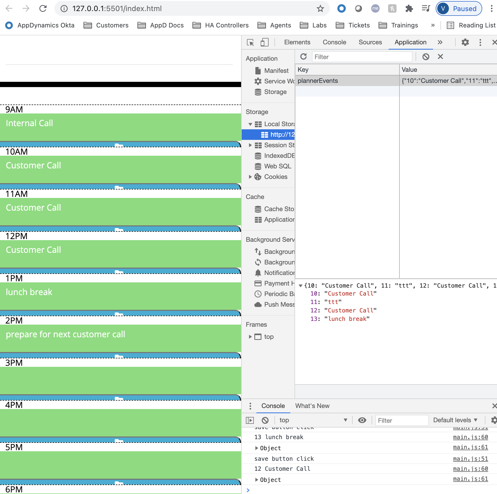

# 05 Third-Party APIs: Work Day Scheduler

## Project Description

The aim of this project is to crate a daily Event Planner with time from 9 Am to 6 PM, where the user can save events for each time.
The project uses:

1.  [Moment.js](https://momentjs.com/) library to format with date and time, in the required format
2.  JQuery to target elements from the HTML
3.  Javascript for the logic of the project
4.  HTML & CSS

## Acceptance Criteria

```md
GIVEN I am using a daily planner to create a schedule
WHEN I open the planner
THEN the current day is displayed at the top of the calendar
WHEN I scroll down
THEN I am presented with timeblocks for standard business hours
WHEN I view the timeblocks for that day
THEN each timeblock is color coded to indicate whether it is in the past, present, or future
WHEN I click into a timeblock
THEN I can enter an event
WHEN I click the save button for that timeblock
THEN the text for that event is saved in local storage
WHEN I refresh the page
THEN the saved events persist
```

### Functions used to fulfill the acceptance Criteria:

### Screenshots

The following printscreen shows how the data is stored in the local storage after save button is clicked



## Review

- The URL of the deployed application: https://vilmaq.github.io/work-day-scheduler

- The URL of the GitHub repository: https://github.com/vilmaq/work-day-scheduler

---

© 2021 Vilma Qerama
